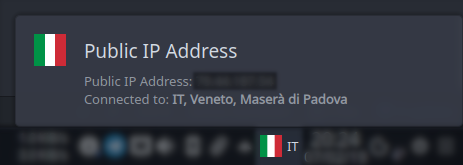
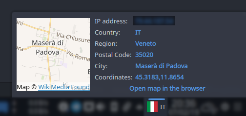

# Public IP Address widget for KDE 5

Plasma 5 widget for showing informations about your public IP address. This is useful for informational purposes and to monitor VPN geolocation.

The expanded view shows a map with informations requested from [ipinfo.com](https://ipinfo.io/): you can copy to clipboard the different informations by clicking over them. You can also open the map on the browser.

By default, the widget update itself every 5 minutes. You can change this behaviour in the settings. Please note that [ipinfo.com](https://ipinfo.io/) API limits the total amount of requests to 1000 per day: this means that the plugin will update itself at most every 2 minutes.

This widget uses the [excellent flags icon pack by lipis and contributors](https://github.com/lipis/flag-icon-css).

## TODO

1. Fix localization

## Installation

### From openDesktop.org

1. Go to **[Opend Desktop](https://www.opendesktop.org/p/1289644/)**
2. Click on the Files tab
3. Click the Install button

### From within the Plasma workspace

1. If your widgets are locked, right-click the desktop and select `Unlock Widgets`
2. Right-click the desktop and select `Add Widgets...`
3. Click the `Get new widgets` button in the Widget Explorer that just opened
4. Type `Shutdown or Switch` into the search field
5. Click the `Install` button next to `Shutdown or Switch`

## FAQ

### The widget is not working. There are errors about `QtPositioning` and `QtLocation`. What can I do?

It may happens that the widget does not load, complaining about something like `QtPositioning` and `QtLocation`. If this is the case and you are using Ubuntu (18.04), run this command:

`sudo apt-get install libqt5positioning5 libqt5location5 qtlocation5-dev qtpositioning5-dev qml-module-qtlocation qml-module-qtpositioning`

In any other distribution, you must look for libraries regarding *qt5 positioning* and *qt5 location*, as well the development libraries and the *qml bindings*.

### Can you add an option to use a different map provider other than OpenStreetMap?

No, because most of other map providers require an API key, whereas OSM does not need it. This means everyone should be able to view the map.
