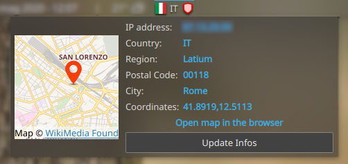

# Public IP Address widget for KDE 6

## Description

Plasma 6 widget for showing informations about your public IP address and the status of your VPN (active/inactive). This is useful for informational purposes and to monitor VPN geolocation.

The expanded view shows a map with informations requested from [ipinfo.com](https://ipinfo.io/): you can copy to clipboard the different informations by clicking over them. You can also open the map on the browser, and update the informations by sending another request.

By default, the widget update itself every 5 minutes. You can change this behaviour in the settings. Please note that [ipinfo.com](https://ipinfo.io/) API limits the total amount of requests to 1000 per day: this means that the plugin will update itself at most every 2 minutes.

You can change the colors of the displayed informations in the settings.

### External Refresh Trigger

You can configure a trigger file path in the widget settings. When this file is modified (e.g., via `touch`), the widget will automatically refresh the IP information. This is useful for integrating with VPN scripts or tools like Tailscale that don't use NetworkManager.

Example usage:
```bash
# Set trigger file in widget settings to: ~/.cache/ip_address_refresh

# Then trigger a refresh from CLI:
touch ~/.cache/ip_address_refresh

# Or integrate with Tailscale:
tailscale set --exit-node=mynode && sleep 2 && touch ~/.cache/ip_address_refresh
```

This widget uses the [excellent flags icon pack by lipis and contributors](https://github.com/lipis/flag-icon-css).




*Master* branch deals with Plasma 6. *plasma5* branch contains the code for Plasma 5.

## Dependencies

The primary functions of the widget (check IP address) should work correctly even if the following dependencies are not installed. Anyway, to get the best experience you need:

* `curl`: this is used to query [ipinfo.com](https://ipinfo.io/). It can be installed with `sudo apt install curl`.
* `libnotify-bin`: this is for showing notifications when clicking links, thus copying the link's content to the clipboard.
`sudo apt install libnotify-bin`
* `nmcli`: this is part of the `network-manager` package. It'll check the status of the VPN by executing the command `nmcli c show --active`; if a VPN is active, there should be some entries containing the keywords `vpn` or `tun`. It should already be installed in Ubuntu. Don't know about other distros (let me know in the comments or by opening an issue).

## Installation

### From openDesktop.org

1. Go to Open Desktop, **[Plasma 5](https://www.opendesktop.org/p/1289644/)** or **[Plasma 6](https://www.pling.com/p/2140275/)**.
2. Click on the Files tab
3. Click the Install button

### From within the Plasma workspace

1. If your widgets are locked, right-click the desktop and select `Unlock Widgets`
2. Right-click the desktop and select `Add Widgets...`
3. Click the `Get new widgets` button in the Widget Explorer that just opened
4. Type `Public IP Address` into the search field
5. Click the `Install` button next to `Public IP Address`

## FAQ

### Where did the map go?

I tested the Plasma 6 version with Kubuntu 24.04 and 25.04. Even when
`libqt6positioning6 libqt6location6 qml6-module-qtlocation qml6-module-qtpositioning`
are installed on the system, the interactive map can't be shown and the logs
showed this error: *"The geoservices provider is not supported"*.

If you have any idea why this happens, let me know!


## How to contribute

Here are the recommended steps to contribute to this widget:

1. fork this repository.
2. download the repository: `git clone https://github.com/<YOUR-USERNAME>/ip_address.git`
3. enter the project directory: `cd ip_address`
4. create a new branch: `git branch -d YOUR-BRANCH-NAME`
5. do the necessary edits and commit them.
6. push the branch to your remote: `git push origin YOUR-BRANCH-NAME`
7. open the Pull Request.

PRs are welcomed. However, each PR should be concise and on point with its intended goal. If a PR claims to implement `feature A` but it also modifies other parts of the code unnecessarely, than it is doing too much and I won't merge it.


**<ins>NOTE about AI-LLM usage</ins>**: I have nothing against the use of these tools. However, many people are unable to properly control their outputs. In practice, these tools often modifies too much. With this in mind:

* If there is a comment in the code, it is very likely to be important to me (the maintainer). Equally important are variable names, function names etc. If the LLM is going to change variable names, remove comments or reorganize the code just for the sake of it, I'll close the PR immediately.
* I prefer that you code manually and understand exactly what you are doing. Remember that at this moment, testing is done manually after each edit, which is time consuming.

